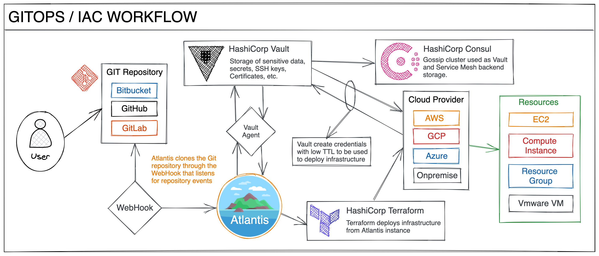

# atlantis-demo
Atlantis Demo Repository

## HOW IT WORKS

- The user writes the code of his project and uploads it to the Git repository.
- The user creates a [Pull | Merge] Request adding an [Approver | Reviewer].
- The [Approver | Reviewer] approves the [Pull | Merge] Request.
- The repository (previously configured the WebHook with Atlantis) sends the events to Atlantis and starts the Workflow process.
- Atlantis communicates with HashiCorp Vault connected through the Vault Agent and asks Vault to generate credentials on the Cloud Provider with a very low TTL.
- Once the credentials are obtained, Atlantis starts planning with Terraform and returns the result of the plan as a comment.
- The developer writes the comment "atlantis apply -p [Project Name]" and Atlantis using Terraform to deploys the infrastructure and returns the deployment result as a comment.
- Terraform remote state is automatically stored in S3/DynamoDB by parameterizing the path using Git repository environment variables.

YouTube Video: https://youtu.be/REwG72a8liM